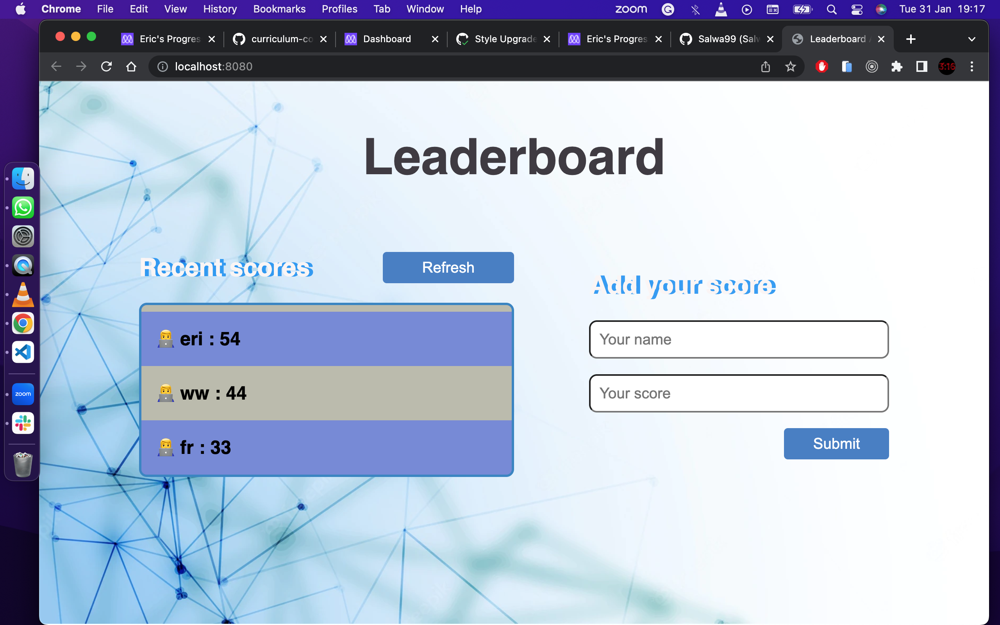

# leaderboard-api
<a name="readme-top"></a>

# 📗 Table of Contents

- [📖 About the Project](#about-project)
  - [🛠 Built With](#built-with)
    - [Tech Stack](#tech-stack)
    - [Key Features](#key-features)
  - [🚀 Live Demo](#live-demo)
- [💻 Getting Started](#getting-started)
  - [Setup](#setup)
  - [Prerequisites](#prerequisites)
  - [Install](#install)
  - [Usage](#usage)
  - [Run tests](#run-tests)
- [👥 Authors](#authors)
- [🔭 Future Features](#future-features)
- [🤝 Contributing](#contributing)
- [⭐️ Show your support](#support)
- [🙏 Acknowledgements](#acknowledgements)
- [📝 License](#license)

# 📖 Leaderboard Api <a name="about-project"></a>

A Javascript app for calling api of a leaderoard. 
Built to understand the callback, promises, proper use of ES6 syntax, ES6 modules to write modular JavaSript & webpack to bundle javaScript.
Also to understand Gitflow process.



## 🛠 Built With <a name="built-with"></a>

### Tech Stack <a name="tech-stack"></a>

<details>
  <summary>Built With</summary>
  <ul>
    <li><a href="https://html.com/">HTML</a></li>
    <li><a href="https://developer.mozilla.org/en-US/docs/Web/CSS">CSS</a></li>
    <li><a href="https://www.javascript.com/">JavaScript ES6</a></li>
    <li><a href="https://webpack.js.org/">Webpack</a></li>
  </ul>
</details>

### Key Features <a name="key-features"></a>

- **Api calls**
- **Wireframes**

<p align="right">(<a href="#readme-top">back to top</a>)</p>

## 🚀 Live Demo <a name="live-demo"></a>

- [Live Demo](https://eric2umeh.github.io/leaderboard-api/dist/)

<p align="right">(<a href="#readme-top">back to top</a>)</p>

## 💻 Getting Started <a name="getting-started"></a>

### Prerequisites

In order to run this project you need: a properly working pc or laptop and a modern web browser.

### Setup

Clone this repository to your desired folder:

```sh
  cd my-folder
  git clone https://github.com/eric2umeh/leaderboard-api.git
```

### Install

Install this project with:

```sh
  - Install the dev dependencies for linters run npm install.
  - run: ```npm  i --save-dev webpack webpack-cli webpack-dev-server @babel/core @babel/preset-env babel-loader style-loader css-loader sass-loader html-webpack-plugin mini-css-extract-plugin ```
```

### Usage

After Installing all the packages run this command ``` npm run start ``` to start dev server and you can just press ```Ctrl + C``` in the terminal and that will kill it and run ``` npm run build ``` to creates a build directory with a production build of your app . 

### Run tests
 Run the following command
- npx eslint .
- npx stylelint "**/*.{css,scss}"

### API keys and credentials

- The base url was gotten from [notion](https://us-central1-js-capstone-backend.cloudfunctions.net/api/)
- The endpoint is https://us-central1-js-capstone-backend.cloudfunctions.net/api/games
- To use a unique id, URL example `/games/Zl4d7IVkemOTTVg2fUdz/scores/`. You can change  the id to youur own key in the getPost.js file or through Postman.
- This can be used for the GET and POST method

<p align="right">(<a href="#readme-top">back to top</a>)</p>

## 👥 Authors <a name="authors"></a>

👤 **Eric Umeohabike**

- GitHub: [Eric Umeohabike](https://github.com/eric2umeh)
- Twitter: [Eric Umeohabike](https://twitter.com/King_Eric_)
- LinkedIn: [Eric Umeohabike](https://www.linkedin.com/in/eric-umeohabike-4a510ba4/)

<p align="right">(<a href="#readme-top">back to top</a>)</p>

## 🔭 Future Features <a name="future-features"></a>

- [ ] **Upgraded style**

<p align="right">(<a href="#readme-top">back to top</a>)</p>

## 🤝 Contributing <a name="contributing"></a>

Contributions, issues, and feature requests are welcome!

Feel free to check the [issues page](https://github.com/eric2umeh/leaderboard-api/issues).

<p align="right">(<a href="#readme-top">back to top</a>)</p>

## ⭐️ Show your support <a name="support"></a>

If you like this project, please give it a star.

<p align="right">(<a href="#readme-top">back to top</a>)</p>

## 🙏 Acknowledgments <a name="acknowledgements"></a>

Thank you [Notion](https://www.notion.so/Leaderboard-API-service-24c0c3c116974ac49488d4eb0267ade3)

<p align="right">(<a href="#readme-top">back to top</a>)</p>

## 📝 License <a name="license"></a>

This project is [MIT](MIT.md) licensed.

<p align="right">(<a href="#readme-top">back to top</a>)</p>